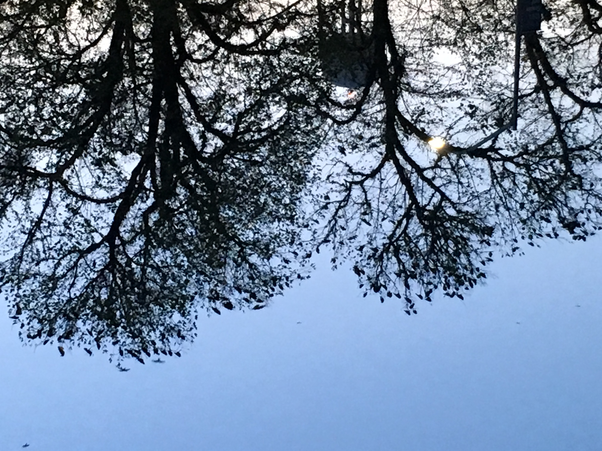

<!-- Elements -->
<!-- <h2 id="elements">Elements</h2> -->
<section>

	

		
I am an aerospace engineer by training and study the fluid mechanics of nature. As a full  time graduate student at <a href="https://ucdavis.edu" target="_blank">UC Davis</a> in the <a href="https://mae.ucdavis.edu" target="_blank">Department of Mechanical and Aerospace Engineering</a>, I use the same modeling techiniques that help us produce flight, to study respiratory flow problems. Before beginning my graduate studies, I spent a few years working at the Boeing Company doing propulsion systems analysis. I received my Bachelor of Science from the <a href="https://aeroastro.mit.edu" target="_blank">Department of Aeronautics and Astronautics</a> at <a href="https://web.mit.edu" target="_blank">MIT</a>, and Boston holds a special place in my heart.

	

	

		
My research interests are divided into three major areas: 1) fluid mechanics of biological systems, 2) medical device development, and 3) respiratory applications of computational methods. My background has positioned my research to be both a developer of numerical modeling techniques and development of practical solutions for problems in respiratory health. My time in the <a href="https://delplanque.faculty.ucdavis.edu/" target="_blank">Computational Multiphase Fluid Dynamics and Thermal Sciences Laboratory</a> at UC Davis has been an absolute pleasure. Dr. Jean-Pierre Delplanque's mentorship as major professsor is unparalleled, and I thank him greatly for his time.

	

	

		
While my research is integral to my daily activities, I strive to improve the academic life for <b>all peoples</b> of <u><em>different backgrounds</em></u>. During my time at UC Davis, I have spent my time in service to the peoples of the university by advocating as Chair of the <a href="https://gsa.ucdavis.edu" target="_blank">Graduate Student Association</a>, mentoring students in my role as graduate student coordinator for <a href="https://ucleads.ucdavis.edu" target="_blank">UC LEADS</a>, or helping others by sharing my path through academic and professional life.

		
When I am not fulfilling my duties for (or at) the university, I spend many hours replicating my mother's and grandmother's cooking. They've taught me the delicate balances of flavors, with chemistry like precision, in order to serve a delicious plate from my Mexican heritage. If you are interested in sharing recipes, please feel free to contact me. I am always happy to <em>trade</em> recipes!

	

</section>
<!-- Class elements sizing, `class = "(num1)u (num1)u` syntax is as follow
first number must be smaller than the second number, and the second number
for example 6u 12u is that the section will take 6/12 units if possible. 
Finally, we should also note that a break between each section is the second
$ sign. So a continuous row section, the first number is not broken until $-->

<section>
	

		

			<h2 id="credits">Credits</h2>
			
Much of the work that I do is open source, and I am far from a main developer of the tools that I use every day. This section is a running list of all those tools that I use to amplify my work.

				<h3 id="webcredits">Website Design</h3>
				
I built this webpage using <a href="https://jekyllrb.com" target="_blank">Jekyll</a> in order to make sure I could integrate IPython notebooks. This webpage's design was originally developed on <a href="https://html5up.net" target="_blank">HTML5 UP</a>. The Jekyll integration was created by <a href="https://andrewbanchi.ch" target="_blank">Andrew Banchich,</a> and part of the <a href="https://github.com/andrewbanchich/editorial-jekyll-theme" target="_blank">Editorial Jekyll Theme</a>. The majority of the images are gathered from the <a href="https://unsplash.com/license" target="_blank">free-to-use</a> website, <a href="https://unsplash.com" target="_blank">Unsplash</a>. To embed YouTube videos, I've graciously borrowed from <a href="https://github.com/nathancy/jekyll-embed-video#responsive-videos" target="_blank">here</a>, which made this incredibly simple.

				<h3 id='tool_credits'>Tools</h3>
				
I use a variety of tools that have helped me through my career, and some of them are listed here along with those that have developed them.

				<ul class="alt">
					<li><a href="https://typora.io" target="_blank">Typora</a>, a simple markdown editor. Mainly use for my notes, and <code>README.md</code> files.</li>
					<li><a href="https://obsproject.com/wiki/Home" target="_blank">OBS Studio</a>, a free and powerful video recording and streaming platform. Useful for creating online teaching content</li>
					<li><a href="https://inkscape.org" target="_blank">Inkscape</a>, a powerful alternative to the Adobe CC suite, for vector image creation. Creating images for publication is probably one of the hardest things to do, but more rewarding activities.</li>
				</ul>
		

		

			<h2 id="contact_us">Contact</h2>
			<!--Form -->
			<form method="post" action="#">
				

					

						<input type="text" name="demo-name" id="demo-name" value="" placeholder="Name" />
					

					

						<input type="email" name="demo-email" id="demo-email" value="" placeholder="Email" />
					

					<!-- Break -->
					

						

							<select name="demo-category" id="demo-category">
								<option value="">- Category -</option>
								<option value="1">Research</option>
								<option value="1">Teaching</option>
								<option value="1">Mentorship</option>
								<option value="1">Service</option>
								<option value="1">Device Development</option>
							</select>
						

					

					<!-- Break -->
					

						<input type="radio" id="demo-priority-low" name="demo-priority" checked>
						<label for="demo-priority-low">Low</label>
					

					

						<input type="radio" id="demo-priority-normal" name="demo-priority">
						<label for="demo-priority-normal">Normal</label>
					

					

						<input type="radio" id="demo-priority-high" name="demo-priority">
						<label for="demo-priority-high">High</label>
					

					<!-- Break -->
					

						<input type="checkbox" id="demo-copy" name="demo-copy">
						<label for="demo-copy">Email me a copy</label>
					

					

						<input type="checkbox" id="demo-human" name="demo-human" checked>
						<label for="demo-human">I am a human</label>
					

					<!-- Break -->
					

						<textarea name="demo-message" id="demo-message" placeholder="Enter your message. In Progress! Not working yet" rows="6"></textarea>
					

					<!-- Break -->
					

						<ul class="actions">
							<li><a href="{{ 'progress.html' | absolute_url }}" class="button">Send Message</a></li>
							<!-- <li><input type="submit" value="Send Message" class="special" /></li> -->
							<li><input type="reset" value="Reset" /></li>
						</ul>
					

				

			</form>
		

		<!-- 

			3
		

		

			4
		

		

			5
		
 -->
	

</section>

