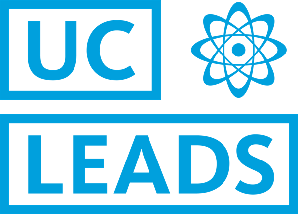

<section>
	<header class="major">
		<h2>Introduction to Research</h2>
	</header>
			
Part of my work at UC Davis is working with extraordinary undergraduate students in the UC-wide program, UC LEADS. During the summer I co-teach a course on research, and teach students some of the often overlooked skills in research.

			<h3>Lessons</h3>
	<ul class="alt">
	
			<li><a href=" {{ lesson_pp.url }} " class="icon fa-book"></a> <a href=" {{ lesson_pp.url }} ">{{ lesson_pp.title }}</a></li>
		
</ul>
</section>

